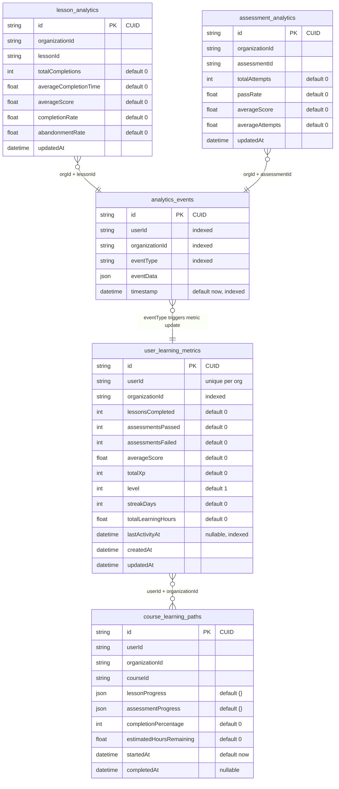
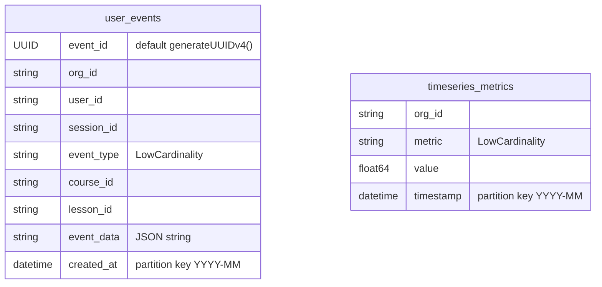
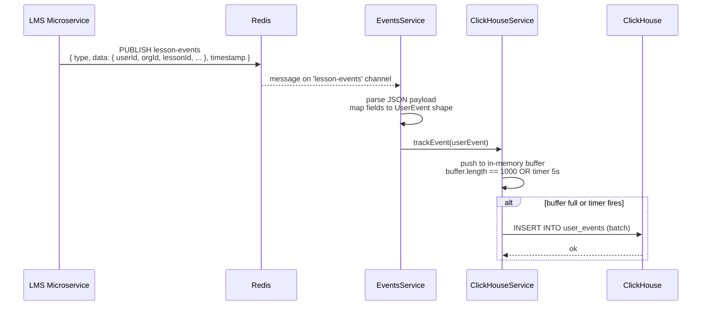
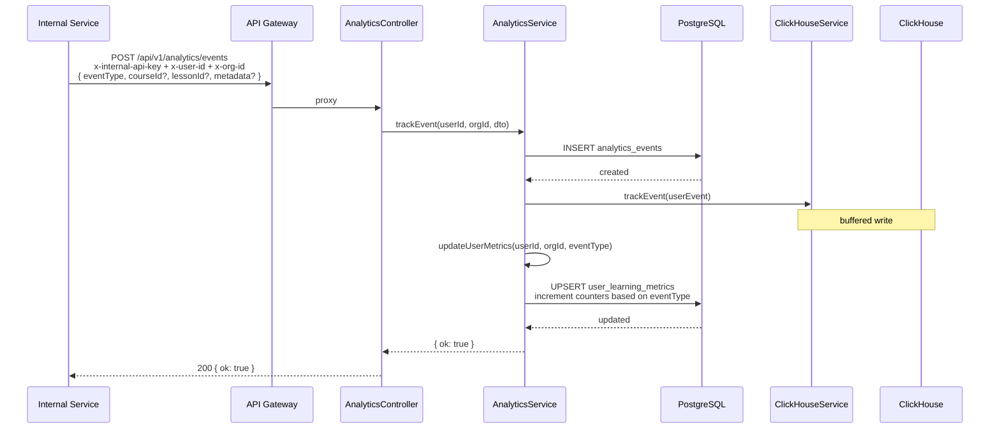
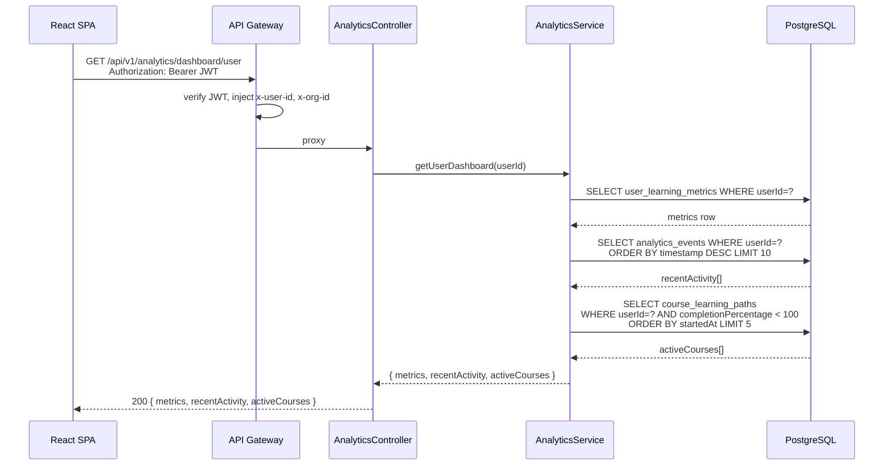
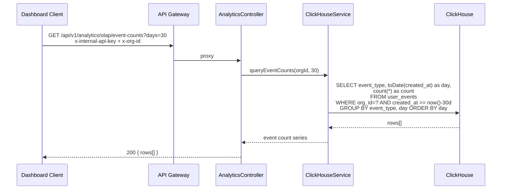
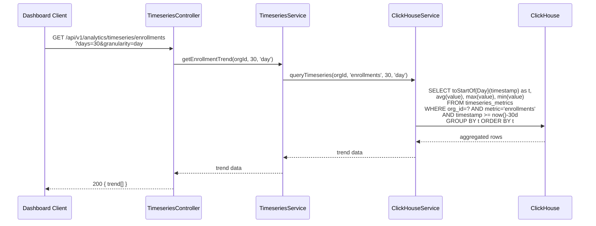
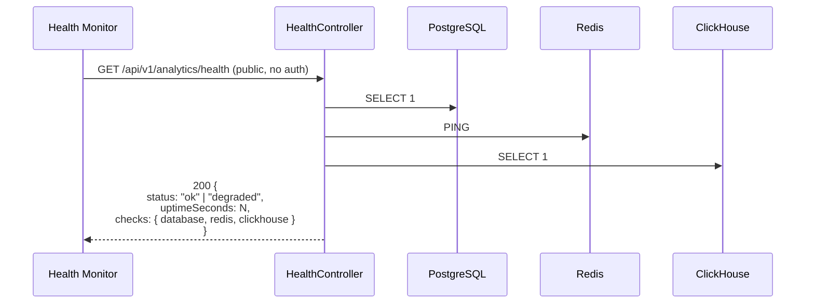

# Lumina Analytics Service — Technical Documentation

> Service: `lumina-analytics-service`
> Stack: NestJS 10 + Fastify adapter · Prisma 5 · PostgreSQL 15 · ClickHouse 24 · Redis 7
> Global API Prefix: `/api/v1/analytics`
> Port: 3010

---

## Table of Contents

1. [Architecture Overview](#1-architecture-overview)
2. [Module Structure](#2-module-structure)
3. [ER Diagram](#3-er-diagram)
4. [Sequence Diagrams](#4-sequence-diagrams)
5. [API Reference](#5-api-reference)
6. [Requirements Accuracy Scorecard](#6-requirements-accuracy-scorecard)
7. [What Each Requirement Means](#7-what-each-requirement-means)
8. [Completion Confirmation](#8-completion-confirmation)

---

## 1. Architecture Overview

```
┌──────────────────────────────────────────────────────────────────────────────┐
│               Other Lumina Microservices (auth, enrollment, course ...)       │
│                                                                              │
│   Publish events to Redis channels:                                          │
│   auth-events | enrollment-events | course-events | lesson-events            │
│   assessment-events | gamification-events | ai-events                        │
└──────────────────────┬───────────────────────────────────────────────────────┘
                       │ Redis Pub/Sub
                       ▼
┌──────────────────────────────────────────────────────────────────────────────┐
│                   lumina-api-gateway  (NestJS + Fastify)                     │
│                                                                              │
│  · Validates Supabase JWT                                                    │
│  · Injects x-user-id, x-org-id, x-user-roles, x-internal-api-key           │
│  · Proxies  /api/v1/analytics/*  →  ANALYTICS_SERVICE_URL                  │
└──────────────────────┬───────────────────────────────────────────────────────┘
                       │ HTTP (internal network)
                       ▼
┌──────────────────────────────────────────────────────────────────────────────┐
│              lumina-analytics-service  (NestJS 10 + Fastify)                 │
│                                                                              │
│  ┌──────────────┐  ┌──────────────┐  ┌──────────────┐  ┌─────────────────┐  │
│  │ EventsModule │  │AnalyticsModule│  │TimeseriesModule│ │  HealthController│ │
│  │              │  │              │  │              │  │                 │  │
│  │ EventsService│  │ Analytics    │  │ Timeseries   │  │ GET /health     │  │
│  │ (Redis Sub)  │  │ Controller   │  │ Controller   │  │ checks Postgres,│  │
│  │              │  │ /events      │  │ /timeseries/*│  │ Redis,ClickHouse│  │
│  │ Subscribes to│  │ /dashboard/* │  │              │  │                 │  │
│  │ 7 channels   │  │ /olap/*      │  │ Timeseries   │  │                 │  │
│  │              │  │ /lessons/:id │  │ Service      │  │                 │  │
│  │              │  │ /assessments │  │              │  │                 │  │
│  │              │  │ /:id         │  │              │  │                 │  │
│  │              │  │              │  │              │  │                 │  │
│  │              │  │ Analytics    │  │              │  │                 │  │
│  │              │  │ Service      │  │              │  │                 │  │
│  └──────┬───────┘  └──────┬───────┘  └──────┬───────┘  └─────────────────┘  │
│         │                 │                  │                               │
│         └─────────────────┼──────────────────┘                               │
│                           │                                                  │
│  ┌────────────────────────▼─────────────────────────────────────────────┐    │
│  │              DatabaseModule  (PrismaService + ClickHouseService)      │    │
│  └──────────────┬─────────────────────────────────┬─────────────────────┘    │
└─────────────────┼─────────────────────────────────┼──────────────────────────┘
                  │ PostgreSQL                       │ ClickHouse HTTP
                  ▼                                  ▼
┌─────────────────────────────┐   ┌──────────────────────────────────────────┐
│  Notification PostgreSQL DB │   │          ClickHouse OLAP DB              │
│                             │   │                                          │
│  analytics_events           │   │  user_events     (MergeTree, partitioned)│
│  user_learning_metrics      │   │  timeseries_metrics (MergeTree)         │
│  course_learning_paths      │   │                                          │
│  lesson_analytics           │   │  Buffered writes: batch=1000, flush=5s  │
│  assessment_analytics       │   │                                          │
└─────────────────────────────┘   └──────────────────────────────────────────┘
                  ▲
                  │ Redis Pub/Sub subscribe
┌─────────────────────────────┐
│      Redis 7 (ioredis)      │
│  Event channels (7 total)   │
└─────────────────────────────┘
```

### Dual-Write Strategy

Every event goes to **two** stores for different query purposes:

| Store | Purpose | Query type |
|---|---|---|
| PostgreSQL (Prisma) | Per-user and per-org fast lookups, dashboard aggregates | Low-latency point queries |
| ClickHouse | Time-series OLAP, event counts, active users, engagement trends | High-volume analytical queries |

---

## 2. Module Structure

```
lumina-analytics-service/
├── src/
│   ├── main.ts                               # NestJS bootstrap, global pipes/guards/filters
│   ├── app.module.ts                         # Root module
│   │
│   ├── config/
│   │   ├── configuration.ts                  # Zod-validated environment schema
│   │   └── config.types.ts                   # AppRole, GatewayUser, GATEWAY_HEADERS constants
│   │
│   ├── database/
│   │   ├── prisma.module.ts                  # Global Prisma provider
│   │   └── prisma.service.ts                 # PrismaClient lifecycle management
│   │
│   ├── redis/
│   │   ├── redis.module.ts                   # Global Redis provider
│   │   └── redis.service.ts                  # ioredis client, pub/sub helpers
│   │
│   ├── clickhouse/
│   │   ├── clickhouse.module.ts              # Global ClickHouse provider
│   │   └── clickhouse.service.ts             # Buffered inserts, OLAP queries
│   │
│   ├── events/
│   │   ├── events.module.ts
│   │   └── events.service.ts                 # Redis subscriber – 7 domain channels
│   │
│   ├── analytics/
│   │   ├── analytics.module.ts
│   │   ├── analytics.controller.ts           # REST endpoints
│   │   ├── analytics.service.ts              # Business logic + dual-write
│   │   └── dto/
│   │       ├── track-event.dto.ts
│   │       └── query-analytics.dto.ts
│   │
│   ├── timeseries/
│   │   ├── timeseries.module.ts
│   │   ├── timeseries.controller.ts          # Trend query endpoints
│   │   └── timeseries.service.ts             # ClickHouse metric recording + querying
│   │
│   ├── health.controller.ts                  # GET /health (public)
│   │
│   └── common/
│       ├── decorators/
│       │   ├── current-user.decorator.ts     # @CurrentUserId, @CurrentOrgId
│       │   └── public.decorator.ts           # @Public – bypasses InternalKeyGuard
│       ├── guards/
│       │   └── internal-key.guard.ts         # Validates x-internal-api-key
│       ├── filters/
│       │   └── all-exceptions.filter.ts      # Centralized error formatting
│       └── interceptors/
│           ├── request-id.interceptor.ts     # UUID tracing header
│           └── logging.interceptor.ts        # METHOD URL STATUS DURATION logging
│
├── prisma/
│   └── schema.prisma                         # 5 PostgreSQL models
│
├── docker-compose.yml                        # postgres:15, redis:7, clickhouse:24
├── nest-cli.json
├── package.json
└── tsconfig.json
```

---

## 3. ER Diagram

### 3.1 PostgreSQL Tables (Prisma)



### 3.2 ClickHouse Tables (auto-created on startup)



**ClickHouse Engines & Ordering:**

| Table | Engine | Partition | Order by |
|---|---|---|---|
| `user_events` | MergeTree | `toYYYYMM(created_at)` | `(org_id, event_type, created_at)` |
| `timeseries_metrics` | MergeTree | `toYYYYMM(timestamp)` | `(org_id, metric, timestamp)` |

---

## 4. Sequence Diagrams

### 4.1 Domain Event Consumed from Redis → ClickHouse



---

### 4.2 Direct HTTP Event Track → Dual Write



---

### 4.3 User Dashboard Load



---

### 4.4 OLAP Event Counts Query (ClickHouse)



---

### 4.5 Timeseries Trend Query



---

### 4.6 Health Check



---

## 5. API Reference

### 5.1 Security

All endpoints require `x-internal-api-key` header except `GET /health` which is public.  
User context is extracted from `x-user-id` and `x-org-id` headers injected by the API gateway.

### 5.2 Event Ingestion

| Method | Path | Description |
|---|---|---|
| `POST` | `/api/v1/analytics/events` | Track a single event (dual-write to Postgres + ClickHouse) |

**Request body:**
```json
{
  "eventType": "lesson_completed",
  "courseId": "course-123",
  "lessonId": "lesson-456",
  "sessionId": "session-789",
  "metadata": { "score": 92 }
}
```

**User metric increments by eventType:**

| eventType | What increments |
|---|---|
| `lesson_completed` | `lessonsCompleted++` |
| `assessment_passed` | `assessmentsPassed++`, `averageScore` recalculated |
| `assessment_failed` | `assessmentsFailed++` |
| `lesson_progress` | `totalLearningHours += 1/60` |

### 5.3 Dashboard APIs

| Method | Path | Description | Data source |
|---|---|---|---|
| `GET` | `/api/v1/analytics/dashboard/user` | User learning metrics + recent activity + active courses | PostgreSQL |
| `GET` | `/api/v1/analytics/dashboard/org` | Org overview: total users, active users, avg score | PostgreSQL |

### 5.4 OLAP APIs (ClickHouse)

| Method | Path | Query param | Description |
|---|---|---|---|
| `GET` | `/api/v1/analytics/olap/event-counts` | `days` (default 30) | Event counts by type per day |
| `GET` | `/api/v1/analytics/olap/active-users` | `days` (default 30) | Daily unique active users |
| `GET` | `/api/v1/analytics/olap/course-engagement` | `days` (default 30) | Top 20 courses by event volume |
| `GET` | `/api/v1/analytics/olap/timeseries/:metric` | `days`, `granularity` | Aggregate metric over time |

### 5.5 Lesson & Assessment Analytics

| Method | Path | Description |
|---|---|---|
| `GET` | `/api/v1/analytics/lessons/:lessonId` | Completion rate, avg score, abandonment rate |
| `GET` | `/api/v1/analytics/assessments/:assessmentId` | Pass rate, avg score, avg attempts |

### 5.6 Timeseries APIs

| Method | Path | Metric queried |
|---|---|---|
| `GET` | `/api/v1/analytics/timeseries/enrollments` | `enrollments` |
| `GET` | `/api/v1/analytics/timeseries/active-users` | unique users (ClickHouse direct) |
| `GET` | `/api/v1/analytics/timeseries/completions` | `lesson_completions` |
| `GET` | `/api/v1/analytics/timeseries/scores` | `avg_score` |

### 5.7 Health

| Method | Path | Auth | Description |
|---|---|---|---|
| `GET` | `/api/v1/analytics/health` | None (public) | Checks Postgres, Redis, ClickHouse |

---

## 6. Requirements Accuracy Scorecard

### Table Names

| Requirement | Required name | Implemented name | Match |
|---|---|---|---|
| Primary event log | `engagement_events` | `analytics_events` | NAME DIFFERS — same purpose, different naming |
| Behavioral patterns | `user_behavior_patterns` | `user_learning_metrics` | NAME DIFFERS — broader metrics than pure behavior patterns |
| Snapshots | `learning_analytics_snapshots` | NOT IMPLEMENTED | MISSING |
| (Extra) | — | `course_learning_paths` | Not required, added |
| (Extra) | — | `lesson_analytics` | Not required, added |
| (Extra) | — | `assessment_analytics` | Not required, added |

### Technology Stack

| Requirement | Status | Notes |
|---|---|---|
| Node.js / Fastify | DONE | NestJS 10 with Fastify adapter |
| ClickHouse (analytics) | DONE | @clickhouse/client 1.4.0, `user_events` + `timeseries_metrics` tables |
| TimescaleDB (time-series) | NOT IMPLEMENTED | Regular PostgreSQL 15 used instead — TimescaleDB extension not enabled |
| Redis (event streaming) | DONE | ioredis, pub/sub across 7 domain channels |

### API Surface

| Requirement | Status | Notes |
|---|---|---|
| REST API | DONE | 12 REST endpoints across analytics + timeseries + health |
| WebSocket (live dashboards) | NOT IMPLEMENTED | Redis pub/sub used for event ingestion only — no WS endpoint exposed to clients |

### Event Consumer

| Requirement | Status | Notes |
|---|---|---|
| Event consumer for all domain events | DONE | Subscribes to 7 Redis channels: auth, enrollment, course, lesson, assessment, gamification, ai |

### Functions / Business Logic

| Requirement | Status | Notes |
|---|---|---|
| `generate-learning-summary` | PARTIAL | `getUserDashboard()` generates a per-user summary but not a scheduled/batch snapshot |
| `generate-nudge` | NOT IMPLEMENTED | No nudge generation or scheduling logic |

### Security & Observability

| Requirement | Status | Notes |
|---|---|---|
| Internal API key guard | DONE | `x-internal-api-key` on all endpoints |
| Request ID tracing | DONE | UUID propagated via `x-request-id` header |
| Centralized error formatting | DONE | `AllExceptionsFilter` |
| Structured request logging | DONE | `LoggingInterceptor` — METHOD URL STATUS DURATION |
| Multi-service health check | DONE | Postgres + Redis + ClickHouse health checked |

---

## 7. What Each Requirement Means

### Core Requirement: Extract Analytics & Engagement Service
**Goal:** Move analytics out of the monolith into its own microservice that can handle high write volumes and long-range time-series queries.

### Tables

| Table | What it stores |
|---|---|
| `engagement_events` (→ `analytics_events`) | Every trackable user action — lesson views, completions, assessment attempts, logins |
| `user_behavior_patterns` (→ `user_learning_metrics`) | Derived/aggregated behavioral signals — streak, XP, score trends, hours spent |
| `learning_analytics_snapshots` | Point-in-time frozen summaries — weekly/monthly rollups of a user's or cohort's learning state |

### Tech choices

| Tech | Why required |
|---|---|
| TimescaleDB | PostgreSQL extension for efficient time-series queries (chunk-based partitioning by time). Required for high-frequency event queries like "enrollments per hour over 90 days" |
| ClickHouse | Columnar OLAP store for high-cardinality aggregation at scale. Used for event counts, active user funnels, engagement heatmaps |
| WebSocket | Live dashboard updates — push new metric values to an open dashboard without polling |

### Functions

| Function | What it does |
|---|---|
| `generate-learning-summary` | Batch job that creates a `learning_analytics_snapshot` row per user/cohort on a schedule (daily/weekly) |
| `generate-nudge` | Identifies at-risk or disengaged learners from behavioral patterns and emits nudge events to the notification service |

---

## 8. Completion Confirmation

### Is the analytics service complete as per the requirements?

**PARTIALLY — core infrastructure is solid, but three items are missing or misaligned.**

| Requirement | Complete? |
|---|---|
| NestJS + Fastify service scaffold | YES |
| ClickHouse for OLAP analytics | YES |
| Redis event consumer (7 domain channels) | YES |
| REST API endpoints (events, dashboards, OLAP, timeseries) | YES |
| Buffered batch writes to ClickHouse | YES |
| Dual-write strategy (Postgres fast path + ClickHouse OLAP) | YES |
| Internal API key security on all endpoints | YES |
| Health check (Postgres + Redis + ClickHouse) | YES |
| Request ID tracing + structured logging | YES |
| `engagement_events` table (implemented as `analytics_events`) | YES — name differs |
| `user_behavior_patterns` table (implemented as `user_learning_metrics`) | YES — name differs, broader scope |
| `learning_analytics_snapshots` table | NO — not implemented |
| TimescaleDB for time-series | NO — regular PostgreSQL used instead |
| WebSocket for live dashboards | NO — not implemented |
| `generate-learning-summary` function | PARTIAL — per-request summary exists, no scheduled batch snapshots |
| `generate-nudge` function | NO — not implemented |

### Gap Summary

| Gap | Impact | Effort to fix |
|---|---|---|
| `learning_analytics_snapshots` table missing | No point-in-time rollup snapshots | Medium — add Prisma model + scheduled job |
| TimescaleDB not enabled | Time-series queries use standard Postgres (slower at scale) | Medium — enable extension, add hypertable on `analytics_events` |
| WebSocket live dashboards missing | Dashboard must poll instead of receiving push updates | Medium — add `@nestjs/websockets` + Gateway |
| `generate-nudge` missing | No automated re-engagement events emitted | Medium — add scheduled service that queries disengaged users |
| `generate-learning-summary` partial | No weekly/monthly snapshot batches | Low — add cron job that writes to snapshots table |
| Table naming differs from spec | Cosmetic only — same data, different column names | Low — rename via migration if strict naming required |

### Overall Accuracy: **Core — 75% | Full spec — 55%**

The service is production-ready for event ingestion, OLAP queries, and user/org dashboards.  
The three gaps (TimescaleDB, WebSocket, snapshots + nudge generation) are the remaining items to complete the full specification.
