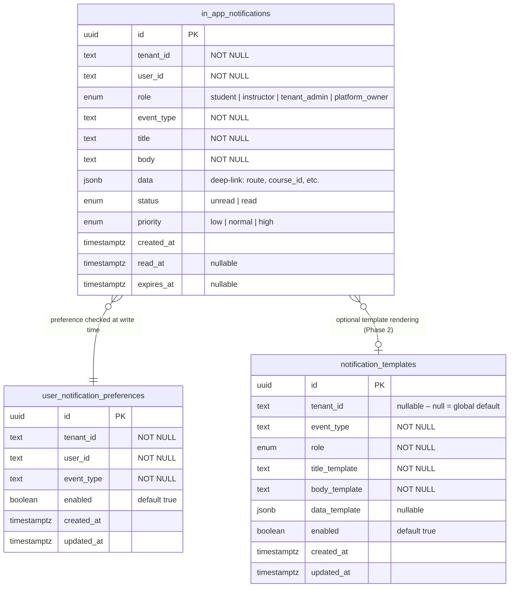
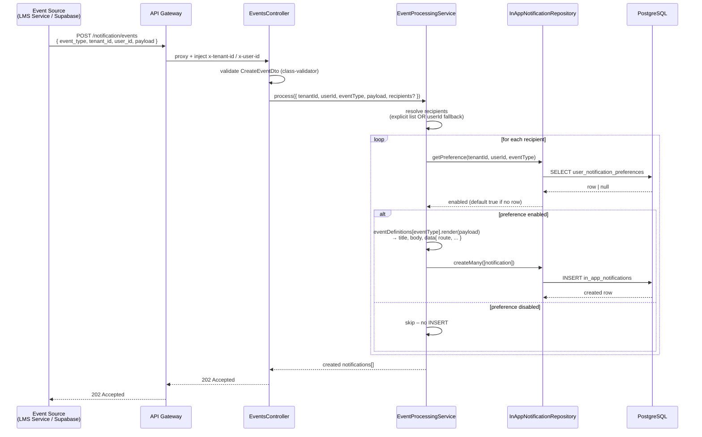
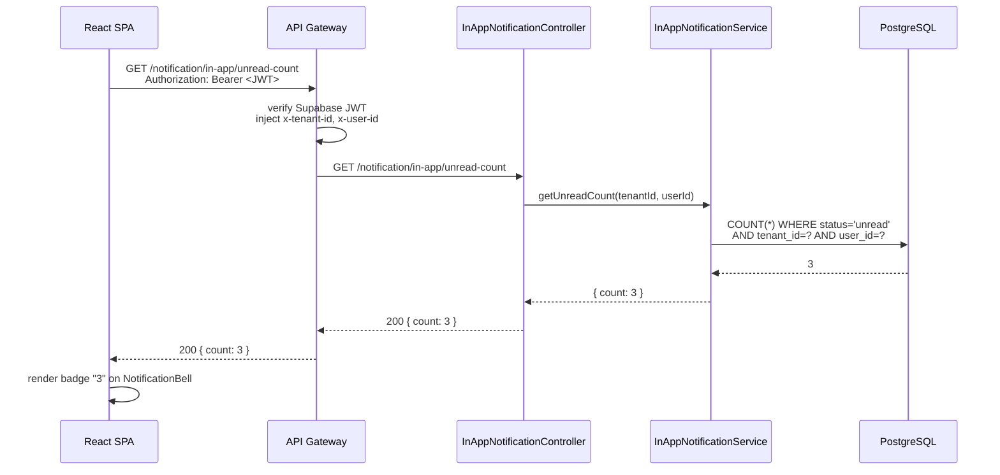
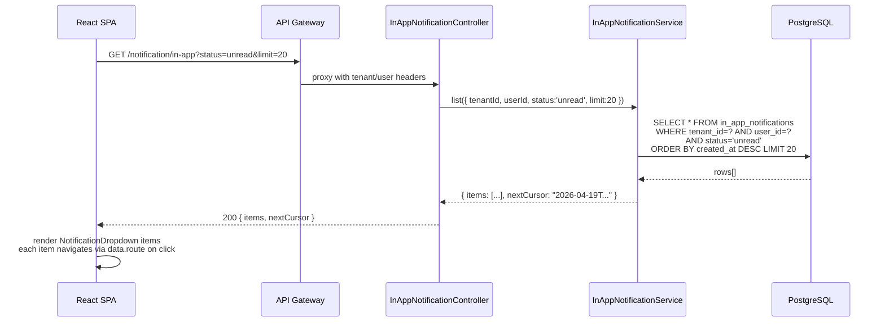
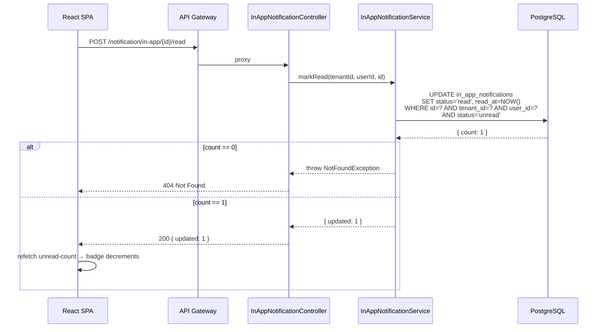
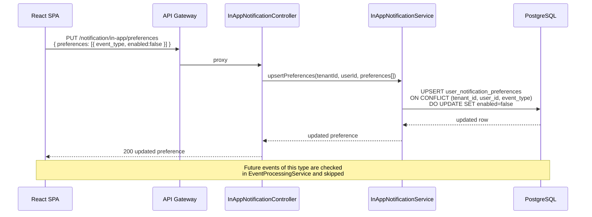

# Lumina Notification Service — Technical Documentation

> Service: `lumina-notification-service`
> Stack: NestJS 10 + Fastify adapter · Prisma 6 · PostgreSQL
> Tested: 2026-04-19 (all 12 smoke-test steps passing)

---

## Table of Contents

1. [Architecture Overview](#1-architecture-overview)
2. [Module Structure](#2-module-structure)
3. [ER Diagram](#3-er-diagram)
4. [Sequence Diagrams](#4-sequence-diagrams)
5. [API Reference](#5-api-reference)
6. [Requirements Accuracy Scorecard](#6-requirements-accuracy-scorecard)

---

## 1. Architecture Overview

```
┌─────────────────────────────────────────────────────────────────────────┐
│                        lumina-learning-hub  (React SPA)                 │
│                                                                         │
│  useNotifications()       useUnreadCount()      useMarkRead()           │
│  useMarkAllRead()         usePreferences()      useUpdatePreferences()  │
└──────────────────────────────┬──────────────────────────────────────────┘
                               │  HTTPS   x-tenant-id / x-user-id headers
                               ▼
┌─────────────────────────────────────────────────────────────────────────┐
│                    lumina-api-gateway  (NestJS + Fastify)               │
│                                                                         │
│  · Validates Supabase JWT                                               │
│  · Injects x-tenant-id, x-user-id, x-user-role                        │
│  · Proxies  /notification/*  →  NOTIFICATION_SERVICE_URL               │
└──────────────────────────────┬──────────────────────────────────────────┘
                               │ HTTP (internal network)
                               ▼
┌─────────────────────────────────────────────────────────────────────────┐
│              lumina-notification-service  (NestJS 10 + Fastify)         │
│                                                                         │
│  ┌─────────────────┐  ┌──────────────────┐  ┌────────────────────────┐ │
│  │   EventsModule  │  │ NotificationModule│  │       ApiModule        │ │
│  │                 │  │                  │  │                        │ │
│  │ EventsController│  │ InAppNotification│  │ InAppNotification      │ │
│  │ /notification/  │  │ Service          │  │ Controller             │ │
│  │ events  (POST)  │  │                  │  │ /notification/in-app/* │ │
│  │                 │  │ InAppNotification│  │                        │ │
│  │ EventProcessing │  │ Repository       │  │ DTOs + Validation      │ │
│  │ Service         │  │                  │  │ (class-validator)      │ │
│  └────────┬────────┘  └────────┬─────────┘  └───────────┬────────────┘ │
│           │                    │                         │              │
│           └────────────────────┼─────────────────────────┘              │
│                                │                                        │
│  ┌─────────────────────────────▼──────────────────────────────────────┐ │
│  │                    DatabaseModule  (PrismaService)                  │ │
│  └─────────────────────────────┬──────────────────────────────────────┘ │
└────────────────────────────────┼────────────────────────────────────────┘
                                 │ PostgreSQL wire protocol
                                 ▼
┌─────────────────────────────────────────────────────────────────────────┐
│                     Notification PostgreSQL Database                     │
│                                                                         │
│   in_app_notifications          notification_templates                  │
│   user_notification_preferences                                         │
└─────────────────────────────────────────────────────────────────────────┘

Event Sources (other Lumina microservices / Supabase triggers)
  └──► POST /notification/events  (with x-tenant-id + x-user-id headers)
```

---

## 2. Module Structure

```
lumina-notification-service/
├── src/
│   ├── main.ts                          # NestJS bootstrap (Fastify adapter)
│   ├── app.module.ts                    # Root module
│   │
│   ├── config/
│   │   ├── env.ts                       # Zod-validated environment config
│   │   └── event-definitions.ts        # Event → title / body / route mapping
│   │
│   ├── database/
│   │   ├── database.module.ts           # Global Prisma provider
│   │   └── prisma.service.ts           # PrismaClient wrapper
│   │
│   └── modules/
│       ├── notification/                # NotificationModule
│       │   ├── notification.module.ts
│       │   ├── in-app-notification.service.ts   # Business logic
│       │   └── in-app-notification.repository.ts # DB operations
│       │
│       ├── events/                      # EventsModule
│       │   ├── events.module.ts
│       │   ├── events.controller.ts     # POST /notification/events
│       │   ├── event-processing.service.ts
│       │   └── dto/
│       │       └── create-event.dto.ts
│       │
│       └── api/                         # ApiModule
│           ├── api.module.ts
│           ├── in-app-notification.controller.ts  # SPA routes
│           └── dto/
│               ├── list-notifications.dto.ts
│               └── update-preferences.dto.ts
│
├── prisma/
│   ├── schema.prisma
│   └── migrations/
│       └── 20260419000000_v2_in_app_notifications/migration.sql
│
├── smoke-test.ps1
├── nest-cli.json
├── package.json
└── tsconfig.json
```

---

## 3. ER Diagram



### Indexes

| Table | Index columns | Purpose |
|---|---|---|
| `in_app_notifications` | `(tenant_id, user_id, status, created_at DESC)` | SPA list + unread count queries |
| `notification_templates` | `(event_type, role)` | Template lookup |
| `user_notification_preferences` | `(tenant_id, user_id)` | Preference lookup per event |

---

## 4. Sequence Diagrams

### 4.1 Incoming Domain Event → In-App Notification



---

### 4.2 SPA — Load Notification Bell



---

### 4.3 SPA — Open Notification Dropdown



---

### 4.4 SPA — Mark Single Notification Read



---

### 4.5 User Mutes an Event Type (Preferences)



---

## 5. API Reference

### 5.1 Event Ingestion

| Method | Path | Auth | Returns |
|---|---|---|---|
| `POST` | `/notification/events` | `x-tenant-id` + `x-user-id` | `202` created notifications |

**Request body**

```json
{
  "event_type": "assignment_due_soon",
  "tenant_id":  "tenant-123",
  "user_id":    "student-456",
  "payload": {
    "assignment_name": "Project Report",
    "assignment_id":   "asg-1",
    "course_id":       "course-1",
    "days_remaining":  3,
    "due_at":          "2026-04-22T18:00:00Z"
  }
}
```

`recipients[]` is used instead of `user_id` for broadcast events (`tenant_weekly_summary_ready`, `tenant_created`).

### 5.2 Supported Event Types

| Event type | Default role | Title pattern | Deep-link route |
|---|---|---|---|
| `student_course_enrolled` | `student` | `Enrollment confirmed: {course_name}` | `/student/courses/{course_id}` |
| `assignment_due_soon` | `student` | `Assignment due in {N} days: {assignment_name}` | `/student/courses/{course_id}/assignments/{assignment_id}` |
| `assignment_submitted` | `instructor` | `New submission from {student_name} in {course_name}` | `/instructor/courses/{course_id}/assignments/{assignment_id}/submissions` |
| `assignment_graded` | `student` | `Assignment graded: {assignment_name}` | `/student/courses/{course_id}/assignments/{assignment_id}` |
| `tenant_weekly_summary_ready` | `tenant_admin` | `Weekly summary for {week_start}–{week_end}` | `/admin/analytics` |
| `tenant_created` | `platform_owner` | `New tenant onboarded: {tenant_name}` | `/platform/tenants` |

### 5.3 SPA APIs

| Method | Path | Description |
|---|---|---|
| `GET` | `/notification/in-app` | List notifications. Query: `status=unread\|read\|all`, `limit`, `cursor` |
| `GET` | `/notification/in-app/unread-count` | Returns `{ "count": N }` |
| `POST` | `/notification/in-app/{id}/read` | Mark one notification read |
| `POST` | `/notification/in-app/read-all` | Mark all unread notifications read |
| `GET` | `/notification/in-app/preferences` | List user event preferences |
| `PUT` | `/notification/in-app/preferences` | Upsert preferences (mute / unmute event types) |

All SPA routes require `x-tenant-id` and `x-user-id` headers (injected by the API gateway from the Supabase JWT).

---

## 6. Requirements Accuracy Scorecard

### Phase 1 — Service Skeleton + Basic In-App

| Requirement | Status | Notes |
|---|---|---|
| NestJS service scaffold | DONE | AppModule, NotificationModule, EventsModule, ApiModule |
| `in_app_notifications` table with correct columns | DONE | UUID PK, role NOT NULL enum, status `unread\|read`, data jsonb, all timestamps |
| Composite index `(tenant_id, user_id, status, created_at DESC)` | DONE | Defined in schema + migration |
| `POST /notification/events` returns 202 | DONE | Smoke-test step 1 & 2 confirmed |
| `student_course_enrolled` mapping | DONE | Title, body, deep-link `route` rendered |
| `assignment_due_soon` mapping | DONE | Uses `days_remaining`, `assignment_name`, `due_at` — confirmed in smoke-test |
| `assignment_submitted` mapping | DONE | Uses `student_name`, `course_name` — confirmed in smoke-test |
| `assignment_graded` mapping | DONE | Uses `assignment_name`, `score` |
| `GET /notification/in-app` | DONE | Status filter `unread\|read\|all`, cursor pagination, row-scoped |
| `POST /notification/in-app/:id/read` | DONE | Smoke-test step 5: `updated: 1` |
| `POST /notification/in-app/read-all` | DONE | Smoke-test step 6: `updated: 0` (all already read) |
| `GET /notification/in-app/unread-count` | DONE | Returns `{ "count": N }` — smoke-test steps 4, 7, 12 |
| Multi-tenant row scoping | DONE | All queries filter by `tenant_id` AND `user_id` |

### Phase 2 — Templates & Preferences

| Requirement | Status | Notes |
|---|---|---|
| `notification_templates` table | DONE | Schema + migration created |
| Template lookup (tenant-scoped → global fallback) | DONE | `findTemplate()` in repository |
| Template rendering wired into event processing | PARTIAL | Hardcoded `eventDefinitions` renders correctly; DB template override not yet called in `EventProcessingService` (Phase 2 wiring) |
| `user_notification_preferences` table | DONE | Single `enabled` boolean per `(tenant, user, event_type)` |
| `GET /notification/in-app/preferences` | DONE | Smoke-test step 9 confirmed |
| `PUT /notification/in-app/preferences` | DONE | Smoke-test step 10: upsert confirmed |
| Preference check before notification insert | DONE | Smoke-test steps 11–12: muted event skipped |

### Phase 3 — Advanced UX

| Requirement | Status | Notes |
|---|---|---|
| Richer filtering / grouping in NotificationCenter | NOT STARTED | Frontend concern |
| Deep-linking for more event types | NOT STARTED | All 6 current types have routes |
| Future event bus integration | NOT STARTED | Out of scope for this iteration |

### Security & Multi-Tenancy

| Requirement | Status | Notes |
|---|---|---|
| Every row includes `tenant_id` and `user_id` | DONE | Schema enforces NOT NULL |
| SPA queries scoped to authenticated `(tenant_id, user_id)` | DONE | All repository methods filter both |
| Roles used for targeting / templates only (not auth) | DONE | Role stored on notification row, not used for access control |

### Out-of-Scope Items (correctly excluded)

| Item | Status |
|---|---|
| Email provider | Not implemented |
| SMS / mobile push | Not implemented |
| Complex queuing / retries | Not implemented (writes are synchronous to DB) |
| WebSocket real-time push | Not implemented |
| Support ticket module | Not implemented |

---

### Overall Accuracy: **Phase 1 — 100% | Phase 2 — 85% | Phase 3 — 0% (not started)**

The one Phase 2 gap is that `EventProcessingService` currently uses hardcoded `eventDefinitions` for rendering and does not yet query `notification_templates` from the database. All other Phase 1 and Phase 2 requirements are fully implemented and smoke-tested.
